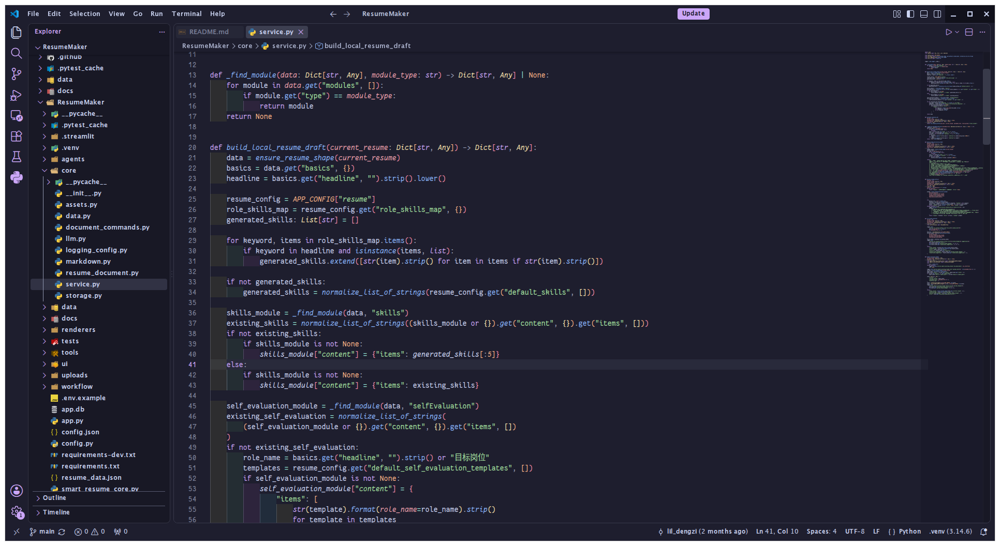
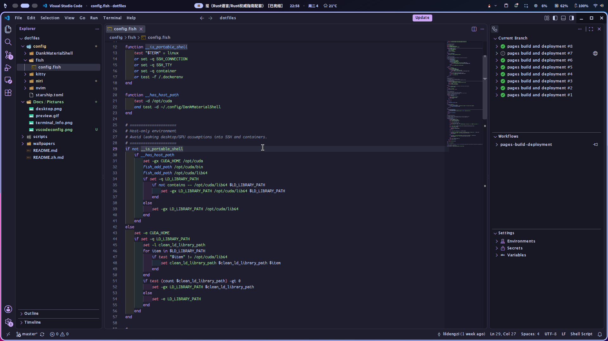
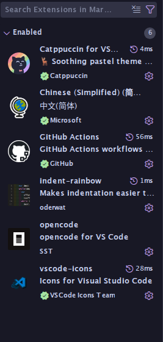

# dotfiles

[中文](./README.md)


Personal dotfiles on Linux (Arch-based) — niri + DMS + Kitty + fish + Neovim.
The repo's `.config/` is the actual `~/.config` tree in use (with proxy/secrets removed).

## What's included

| Component | Config |
|-----------|--------|
| **WM** | niri with Material You shell (DMS) |
| **Terminal** | Kitty (dank theme), FantasqueSansM Nerd Font |
| **Editor** | Neovim + LazyVim, catppuccin, LSP (rust-analyzer, pyright, ruff), DAP, treesitter, rainbow-delimiters, indent-blankline |
| **File manager** | Yazi terminal file manager, editing via nvim, in-terminal video preview |
| **Code editor** | VSCode + Zed, catppuccin theme, autosave |
| **Prompt** | Starship (GUI / TTY / bash presets) |
| **Shell** | Fish with fastfetch alias |
| **Desktop tools** | fastfetch, mpv, btop, cava, MangoHud, GTK/fontconfig, env & autostart |
| **Wallpapers** | 33 curated wallpapers |
| **Windows config** | starship, wezterm, nushell, komorebi, autohotkey, scoop/winget manifest backups |

## Screenshots


### Neovim


### Yazi


### VSCode







## Quick start

One-liner (downloads and launches the installer):

```sh
curl -fsSL https://raw.githubusercontent.com/lildengzi/dotfiles/master/scripts/bootstrap.sh | sh
```

Or clone locally:

```sh
git clone https://github.com/lildengzi/dotfiles
cd dotfiles
sh scripts/install.sh
```

Choose from:
1. **Full desktop** — niri + DMS + Kitty + nvim + yazi + fish + starship + vscode + font + all configs
2. **Terminal + editor only** — Kitty + nvim + yazi + starship + font
3. **Pick your own** — select individual components
4. **Config only** — copy the whole `.config/`, install nothing

Each component can also be installed individually (all scripts are POSIX sh, no bash needed):

```sh
sh scripts/install-config.sh   # copy the whole .config (no software)
sh scripts/install-font.sh    # FantasqueSansM Nerd Font
sh scripts/install-kitty.sh   # Kitty terminal
sh scripts/install-nvim.sh    # Neovim (LazyVim)
sh scripts/install-yazi.sh    # Yazi file manager
sh scripts/install-niri.sh    # niri WM
sh scripts/install-fish.sh    # Fish shell
sh scripts/install-starship.sh # Starship prompt
sh scripts/install-vscode.sh  # VSCode config (install VSCode itself manually)
```

Scripts auto-detect your distro (Arch, Fedora, Debian, openSUSE) and pick the right package manager,
back up existing configs, and install missing dependencies (non-Arch not fully guaranteed).

## Windows config

Windows configurations (starship, wezterm, nushell, komorebi, autohotkey, scoop/winget manifests) are completely isolated from Linux configs and stored in the `windows/` directory.

### Deployment

```powershell
# Copy all config files to the correct paths (no software installation)
.\scripts\setup-windows.ps1 -SkipSoftware

# Copy configs and attempt software installation (installation failures won't stop config deployment)
.\scripts\setup-windows.ps1

# Show help
.\scripts\setup-windows.ps1 -Help
```

### Manifest import (manual)

Scoop and winget manifests are backups only — they are not auto-imported. To restore manually:

```powershell
# Restore scoop manifest
scoop import $env:USERPROFILE\scoop-export.json

# Restore winget manifest
winget import $env:USERPROFILE\winget-export.yaml
```

## Disaster recovery

Reinstall lost your machine? Restore every software package from `packages/pkglist.txt`
(a snapshot of explicitly installed packages, including AUR):

```sh
git clone https://github.com/lildengzi/dotfiles
cd dotfiles
paru -S --needed $(cat packages/pkglist.txt)
```

> Note: the snapshot includes CachyOS repo packages (e.g. `linux-cachyos`).
> On a clean Arch install, install and enable [cachyos-mirrorlist](https://github.com/CachyOS/CachyOS-PKGBUILDS/tree/master/cachyos-mirrorlist)
> first, or replace `linux-cachyos` with the stock Arch kernel.

To update the snapshot after installing new packages:

```sh
pacman -Qqe > packages/pkglist.txt
```

## What makes this different

- **POSIX sh install scripts** — every `scripts/*.sh` is pure sh, no bash dependency, runnable on any distro
- **fish `fetch` fallback** — `ff` = `fastfetch`; if fastfetch is missing, the `fetch` command degrades gracefully instead of failing distrobox/SSH startup
- **SSH / container auto-detection** — fish switches to a conservative ASCII prompt over SSH/TTY/containers, so desktop/GPU assumptions don't leak into remote environments
- **CUDA path injection** — `CUDA_HOME` is only set on the host when `/opt/cuda` + DankMaterialShell are present; cleaned up automatically in SSH/containers
- **distrobox stability fixes** — retries with `--root` when the container lacks a passwd entry, and with `--no-tty` on tty allocation failure
- **In-terminal video preview in Yazi** — `mpv --vo=kitty` previews videos right in the file manager, no separate window
- **Kitty muted theme** — bundled `dank-tabs.conf` / `dank-theme.conf` (slanted powerline tabs + grey-purple palette), with CJK font fallback
- **niri recording shortcuts** — `Mod+Alt+R` start / `Mod+Alt+Shift+R` stop recording

## Manual copy

The repo's `.config/` is a ready-to-use `~/.config` tree — copy it straight over:

```sh
git clone --depth 1 https://github.com/lildengzi/dotfiles
cd dotfiles
cp -r .config/* ~/.config/   # merge into your ~/.config
nvim  # auto-installs plugins
```

Want only some components? Use sparse checkout:

```sh
git clone --depth 1 --filter=blob:none --sparse https://github.com/lildengzi/dotfiles
cd dotfiles
git sparse-checkout set .config/kitty .config/nvim .config/yazi .config/starship.toml .config/fish
cp -r .config/* ~/.config/
nvim  # auto-installs plugins
```

## Prerequisites

- [FantasqueSansM Nerd Font](https://github.com/ryanoasis/nerd-fonts/releases) (or run `scripts/install-font.sh`)
- [Neovim](https://github.com/neovim/neovim) ≥ 0.10
- [Kitty](https://sw.kovidgoyal.net/kitty/) (or use your own terminal)
- [Yazi](https://yazi-rs.github.io/) file manager
- [VSCode](https://code.visualstudio.com/) code editor
- [Starship](https://starship.rs/) prompt
- [Fish](https://fishshell.com/) shell

## Notes

- niri/DMS are optional — the terminal + editor work on any WM
- PipeWire audio config and ananicy rules are not included (machine-specific)
- Proxy-related configs are not included (v2ray / sing-box / proxyd / nas-conn etc.)
- Privacy-sensitive items removed: musixmatch token, VPN/NAS server addresses, clangd machine paths
- Neovim config uses lazy.nvim and will auto-install all plugins on first launch
- Built on Linux (Arch-based); scripts auto-detect your distro and package manager, non-Arch not fully guaranteed
