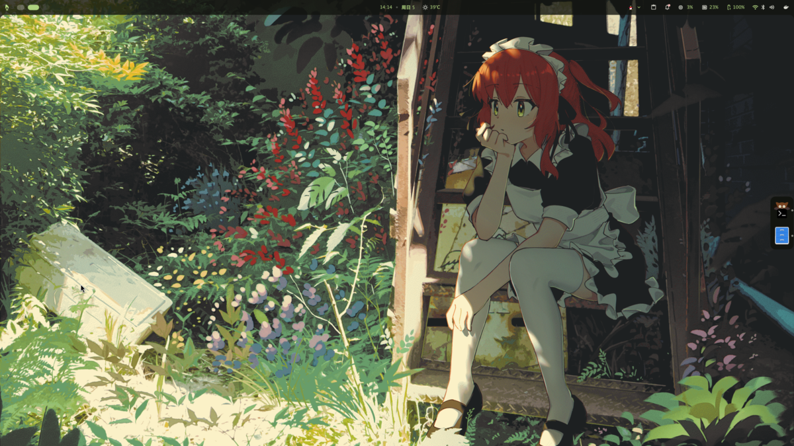
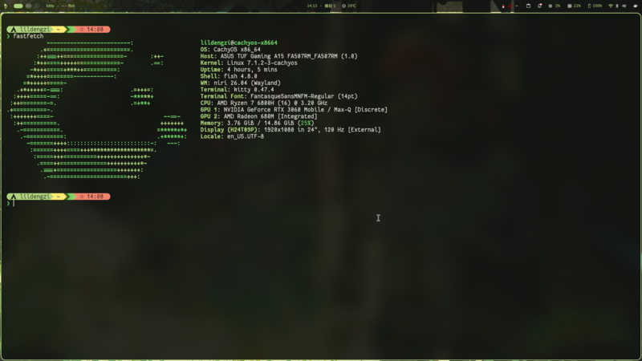

# niri dotfiles



A niri + DMS desktop configuration on CachyOS.

## What's included

| Component | Config |
|-----------|--------|
| **WM** | niri 26.04 with Material You shell (DMS) |
| **Terminal** | Kitty 0.47 with FantasqueSansM Nerd Font |
| **Prompt** | Starship powerline-style with OS detection |
| **Shell** | Fish with fastfetch alias |
| **Wallpapers** | 20 curated wallpapers |

## Screenshots



<video src="https://github.com/lildengzi/dotfiles/releases/download/assets-v1/show.mp4" controls width="600"></video>

## Install

```bash
git clone https://github.com/lildengzi/dotfiles
cd dotfiles
bash install.sh
```

Restart your session after installation.

## Notes

- Requires niri Wayland compositor and DMS
- PipeWire audio config and ananicy rules are not included (machine-specific)
- Proxy configuration is not included
- Built on CachyOS, but should work on any Arch-based distro
