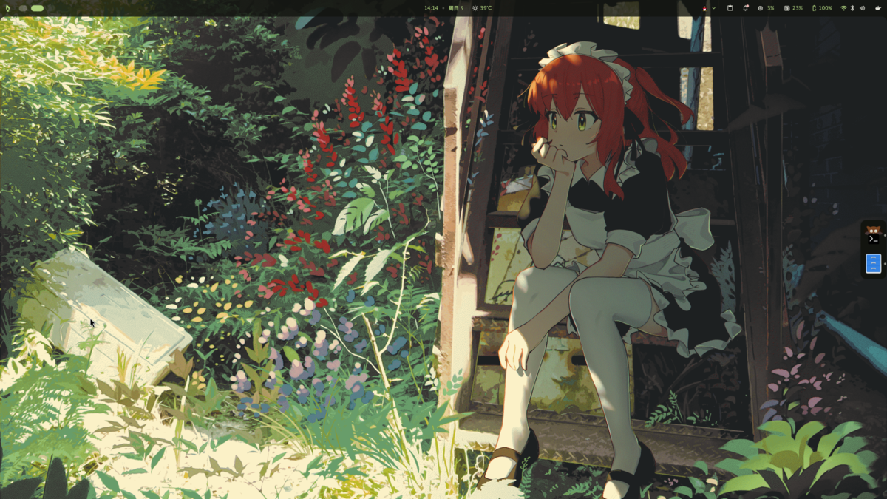
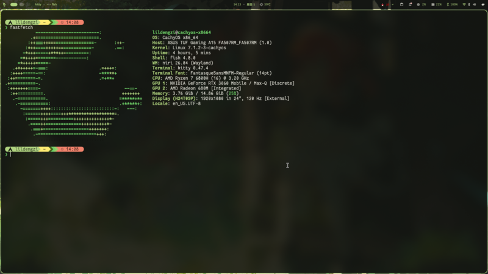
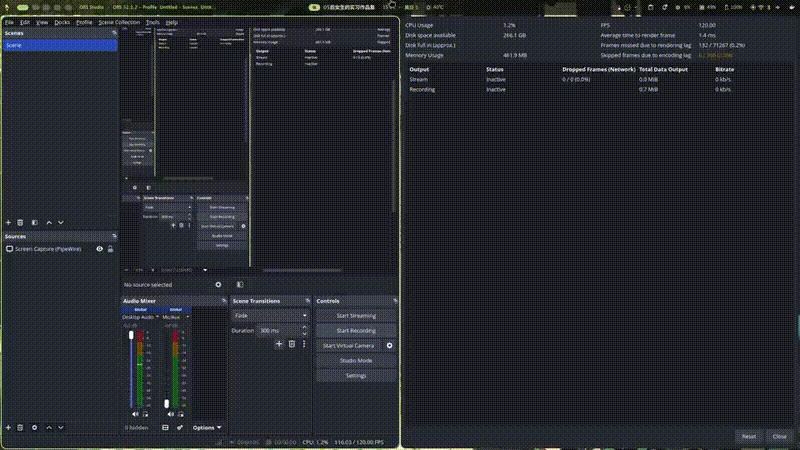
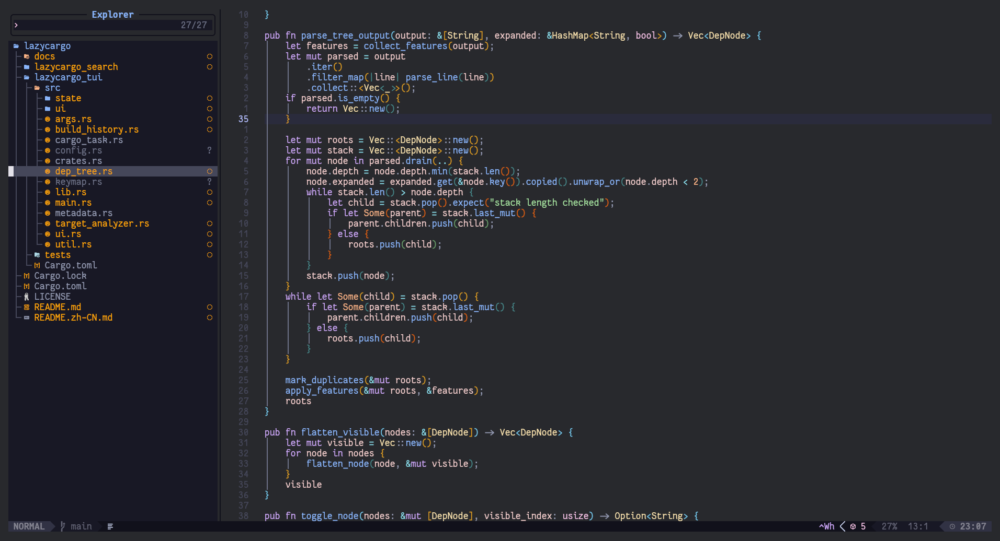
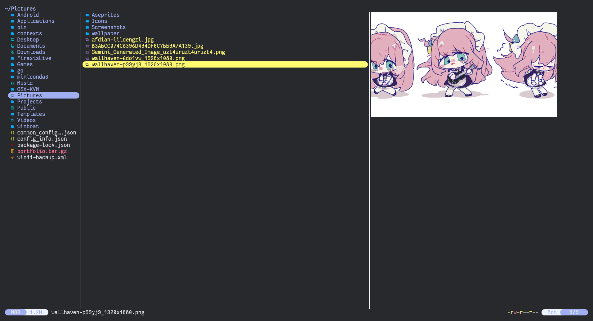

# dotfiles

[English](./README.en.md)



个人 dotfiles，运行于 Linux（基于 Arch 系）— niri + DMS + Kitty + fish + Neovim。
仓库的 `.config/` 就是实际使用的 `~/.config` 目录树（去除了代理/密钥等隐私）。

## 包含什么

| 组件 | 配置 |
|------|------|
| **窗口管理器** | niri + Material You 桌面壳 (DMS) |
| **终端** | Kitty（dank 主题），字体 FantasqueSansM Nerd Font |
| **编辑器** | Neovim + LazyVim，配色 catppuccin，LSP (rust-analyzer / pyright / ruff)，DAP 调试，treesitter 语法高亮，彩虹括号，缩进线 |
| **文件管理器** | Yazi 终端文件管理器，编辑默认使用 nvim，支持终端内播放视频 |
| **代码编辑器** | Zed（VSCode 配置云端同步，不入仓库） |
| **提示符** | Starship（GUI / TTY / bash 三套配置） |
| **Shell** | Fish，带 fastfetch 别名 |
| **桌面工具** | fastfetch、mpv、btop、cava、MangoHud、GTK/fontconfig、环境变量与自启动 |
| **壁纸** | 24 张精选壁纸 |

## 截图





### Neovim



### Yazi



## 快速安装

一行命令（自动下载并启动安装器）：

```sh
curl -fsSL https://raw.githubusercontent.com/lildengzi/dotfiles/master/scripts/bootstrap.sh | sh
```

或者克隆到本地：

```sh
git clone https://github.com/lildengzi/dotfiles
cd dotfiles
sh scripts/install.sh
```

选择菜单：
1. **Desktop** — 桌面外观（niri + DMS + 壁纸 + 自启动 + 外观）
2. **Work** — 工作环境（nvim + yazi + kitty + fish + starship + 终端工具 + 字体 + JDK）
3. **Agent** — AI agent 工具链（opencode + skills + claude + npm 全局工具）
4. **Packages** — 系统软件（按分类安装）
5. **VMs** — 虚拟机恢复（winboat / distrobox / waydroid / AVD / OSX-KVM / podman）

也可以单独安装某个组件（脚本全部为 POSIX sh，无需 bash）：

```sh
sh scripts/install-config.sh   # 复制全部 .config 配置（不装软件）
sh scripts/install-font.sh    # FantasqueSansM Nerd Font 字体
sh scripts/install-kitty.sh   # Kitty 终端
sh scripts/install-nvim.sh    # Neovim 编辑器 (LazyVim)
sh scripts/install-yazi.sh    # Yazi 文件管理器
sh scripts/install-niri.sh    # niri 窗口管理器
sh scripts/install-fish.sh    # Fish shell
sh scripts/install-starship.sh # Starship 提示符
sh scripts/install-packages.sh # 按分类安装包（如 sh install-packages.sh desktop aur）
```

安装脚本会自动检测你的发行版（Arch、Fedora、Debian、openSUSE 等）并选择合适的包管理器，
备份已有配置，并安装缺少的依赖（非 Arch 系不保证完全可用）。

## 灾难恢复

电脑重装/系统炸了，按步骤恢复：

**1. 装包（按分类）**

```sh
git clone https://github.com/lildengzi/dotfiles
cd dotfiles
sh scripts/install-packages.sh system drivers cachyos desktop third-party
sh scripts/install-packages.sh aur        # 需要 paru
sh scripts/install-agent-tools.sh         # agent npm 全局工具（codex 等）
```

`packages/` 下有 7 个分类清单：system / desktop / drivers / cachyos / third-party / aur / toolchain。

> 注意：cachyos 分类含 cachyos 仓库的包（如 `linux-cachyos`）。
> 若重装的是纯净 Arch，先安装并启用 [cachyos-mirrorlist](https://github.com/CachyOS/CachyOS-PKGBUILDS/tree/master/cachyos-mirrorlist)，
> 或用 Arch 内核替代 `linux-cachyos`。

**2. 装配置（嵌套菜单）**

```sh
sh scripts/install.sh
```

选择 Desktop / Work / Agent，每个子项可单独勾选。

**3. 恢复虚拟机（数据在 `/mnt/E/Rescue`）**

```sh
sh scripts/restore/winboat.sh    # Windows 虚拟机（配置 + 数据）
sh scripts/restore/distrobox.sh  # 重建 5 个 distrobox 容器
sh scripts/restore/waydroid.sh   # waydroid
sh scripts/restore/avd.sh        # Android 模拟器
sh scripts/restore/osx-kvm.sh    # macOS VM
sh scripts/restore/podman.sh     # podman 容器
```

小配置在 `vms/`，大数据从 `/mnt/E/Rescue` 拷贝。

**4. 硬件覆盖（仅本机）**

```sh
sh scripts/apply-machine.sh       # 只在 lildengzi-cachyos 写入 HDMI-A-1 等硬件位
```

## 更新包清单

```sh
pacman -Qqe | sort > packages/system.txt   # 按分类手动归入
pacman -Qqm > packages/aur.txt             # AUR 包
```

## 与众不同之处

- **解耦安装** — Desktop（桌面外观）/ Work（工作环境）/ Agent（AI 工具链）三大类，各自子项可单独勾选，互不捆绑
- **分类包清单** — `packages/` 下 7 类，系统/桌面/驱动/CachyOS/第三方/AUR/工具链按需安装
- **agent 工具链独立记录** — codex 等 npm 全局工具在 `packages/toolchain.txt`，`install-agent-tools.sh` 一键恢复
- **POSIX sh 安装脚本** — 所有 `scripts/*.sh` 都是纯 sh，不依赖 bash，任何发行版都能直接 `sh` 运行
- **fish 的 fetch 回退** — `ff` = `fastfetch`；如果系统没有 fastfetch，`fetch` 命令会优雅降级，不会在 distrobox/SSH 里启动失败
- **SSH / 容器自动检测** — fish 检测到 SSH、TTY、容器时会自动切换到保守的 ASCII 提示符，避免把桌面/GPU 假设泄漏进远程环境
- **CUDA 路径自动注入** — 只有宿主机检测到 `/opt/cuda` 和 DankMaterialShell 时才设置 `CUDA_HOME`，SSH/容器里自动清理
- **distrobox 稳定性修复** — 容器缺 passwd 条目时自动用 `--root`，tty 分配失败时自动 `--no-tty` 重试
- **Yazi 终端内播放视频** — `mpv --vo=kitty` 直接在文件管理器里预览视频，不弹独立窗口
- **Kitty 淡雅主题** — 内置 `dank-tabs.conf` / `dank-theme.conf`（slanted powerline 标签栏 + 灰紫配色），CJK 字体自动回退
- **niri 录屏快捷键** — `Mod+Alt+R` 开始 / `Mod+Alt+Shift+R` 停止录屏
- **壁纸自动归位** — `install-walls.sh` 把壁纸复制到 `~/Pictures/wallpapers`，DMS 直接引用
- **硬件配置通用化** — `outputs.kdl` 保持通用，本机硬件位由 `apply-machine.sh` 单独写入

## 手动复制

仓库的 `.config/` 就是完整的 `~/.config` 目录树，直接拷就能用：

```sh
git clone --depth 1 https://github.com/lildengzi/dotfiles
cd dotfiles
cp -r .config/* ~/.config/   # 合并进你的 ~/.config
nvim  # 打开后自动安装插件
```

只拿部分组件，可用 sparse checkout：

```sh
git clone --depth 1 --filter=blob:none --sparse https://github.com/lildengzi/dotfiles
cd dotfiles
git sparse-checkout set .config/kitty .config/nvim .config/yazi .config/starship.toml .config/fish
cp -r .config/* ~/.config/
nvim  # 打开后自动安装插件
```

## 前置依赖

- [FantasqueSansM Nerd Font](https://github.com/ryanoasis/nerd-fonts/releases)（或运行 `scripts/install-font.sh`）
- [Neovim](https://github.com/neovim/neovim) ≥ 0.10
- [Kitty](https://sw.kovidgoyal.net/kitty/)（也可以用你自己的终端）
- [Yazi](https://yazi-rs.github.io/) 文件管理器
- [Zed](https://zed.dev/) 代码编辑器
- [Starship](https://starship.rs/) 提示符
- [Fish](https://fishshell.com/) shell
- JDK（可选，`scripts/profiles/work.sh` 可自动安装 `jdk-openjdk`）

## 备注

- niri/DMS 是可选的 — 终端 + 编辑器在任何窗口管理器下都能用
- PipeWire 音频配置和 ananicy 规则不含在内（机器相关）
- 代理相关配置不含在内
- 隐私敏感项已清除：musixmatch token、VPN/NAS 服务器地址、clangd 机器路径等
- VSCode 配置不入仓库（云端同步），Zed 保留
- Neovim 配置使用 lazy.nvim，首次打开会自动安装所有插件
- 基于 Linux（Arch 系），脚本会自动检测发行版并选择包管理器，但非 Arch 系不保证完全可用
